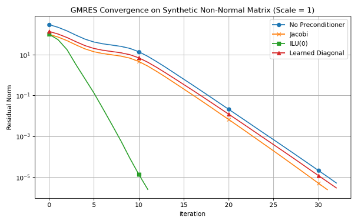
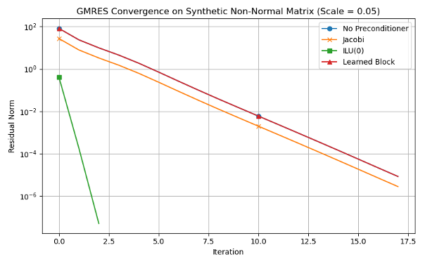

# Learned Preconditioning to Accelerate GMRES Convergence

This project explores the use of neural networks to learn effective preconditioners for accelerating GMRES convergence, specifically for non-normal sparse matrices. Traditional preconditioners like Jacobi and ILU(0) often struggle with non-normality, which is common in directional systems such as advection-diffusion problems. This work investigates whether learned diagonal and block preconditioners can offer a lightweight, adaptive alternative.

## Executive Summary
**Goal.** Learn lightweight preconditioners (diagonal, 4×4 block) that reduce GMRES iterations on non-normal sparse systems vs. Jacobi / block-Jacobi / ILU(0).

**Outcome.** The learned preconditioners did **not** consistently outperform the classical baselines across matrix families; in several cases they regressed.

**Value.** This repo documents the approach, evaluation protocol, and failure modes—useful for others exploring learned preconditioning.

### Results at a Glance

<p align="center">
  
</p>
<p align="center"><sub><em>Diagonal: synthetic non-normal (Scale = 1). Learned ≈ Jacobi; ILU(0) strongest.</em></sub></p>

<p align="center">
  
</p>
<p align="center"><sub><em>Block 4×4: synthetic non-normal (Scale = 0.05). Current model underperforms.</em></sub></p>

**Takeaways**
- Learned **diagonal** ≈ Jacobi on some non-normal regimes, but no clear win.
- Learned **block (4×4)** underperformed—training time/regularization likely the bottleneck.

## Table of Contents
- [Overview](#overview)
- [Project Files](#project-files)
- [Implementations](#implementations)
  - [Diagonal Preconditioner (Phase 1)](#diagonal-preconditioner-phase-1)
  - [Block Preconditioner (Phase 2)](#block-preconditioner-phase-2)
- [Benchmarking](#benchmarking)
- [How to Run](#how-to-run)
- [Results](#results)

---

## Overview

The project is divided into two phases:

1. **Phase 1:** A lightweight diagonal preconditioner is learned by training a neural network on row-wise features of synthetic non-normal matrices. These features include the diagonal value, row norm, max absolute value, and diagonal dominance.

2. **Phase 2:** A more powerful block-based preconditioner is learned, where the model predicts 4×4 blocks using a shared MLP. The blocks are regularized to ensure invertibility.

Both models are trained to minimize the GMRES residual norm using a log-scaled reward function.

---

## Project Files
- benchmark.py           : Benchmarking diagonal preconditioners
- benchmark_block.py     : Benchmarking block preconditioners
- train_p1.py          : Train diagonal preconditioner
- train_p2.py          : Train block preconditioner
- igs_gmres.py         : GMRES with reorthogonalization
- mgs_gmres.py         : Standard GMRES implementation
- model.py             : Neural network model definitions
- preconditioners.py   : Apply and evaluate learned preconditioners
- load_mtx.py          : Load matrix data
- load_vector.py       : Load RHS vector
- diag_synth.pt        : Trained diagonal model
- mgs_block_model.pt   : Trained block model (MGS)

---

## Implementations

### Diagonal Preconditioner (Phase 1)

- Trained MLP model maps row-wise features to log-scaled diagonal values.
- Lightweight and cheap to compute, requiring only simple statistics of each row.
- Trained via reinforcement learning using the GMRES residual norm as reward.

### Block Preconditioner (Phase 2)

- Divides the matrix into 4×4 blocks.
- Each block is passed through a shared MLP to predict a preconditioner matrix.
- Outputs are regularized (`M = B·Bᵗ + εI`) to ensure invertibility.
- Applied in a chunk-wise fashion to transform the system for GMRES.

---

## Benchmarking

- Run `python3 benchmark.py` for diagonal benchmarking.
- Run `python3 benchmark_block.py` for block benchmarking.
- Models are evaluated against:
  - No preconditioner
  - Jacobi
  - ILU(0)
- Synthetic Poisson matrices are used with increasing non-normality (via added sparse upper-triangular noise).
- GMRES solves until the residual norm drops below 1e-5 or max 300 iterations.

---

## How to Run

1. **Train the Models:**
```bash
python3 train_p1.py  # Diagonal
python3 train_p2.py  # Block
```

2. **Benchmark:**
```bash
python3 benchmark.py
python3 benchmark_block.py
```

3. **Plotting:**
```bash
python3 plot.py
```

## Results
- **Diagonal Model:**
    - Competitive with Jacobi on both mild and strong non-normal matrices.
	- Lightweight and parallelizable.
- **Block Model:**
	- Underperformed due to training time constraints.
	- Potential remains high with more compute and larger blocks.

### Failure Analysis (What Didn’t Work)
- **Objective mismatch.** Minimizing a proxy (e.g., \|I − MA\|_F or low-k unrolled GMRES) didn’t translate to fewer iterations at test time.
- **Structure/stability.** Unconstrained blocks sometimes harmed GMRES stability; SPD/structure constraints helped but limited capacity.
- **Generalization.** Models trained on one matrix family didn’t transfer to others (spectral properties shift).
- **Overhead.** Compute/memory cost of constructing M reduced any small iteration gains.

### Lessons & Next Steps
- Strong baselines (ILU(0), block-Jacobi) are hard to beat across families.
- Constrain learning (SPD, sparsity tied to A, row/col scalings) to preserve GMRES properties.
- Explore objectives that target **eigenvalue clustering** / spectrum shaping.
- More promising directions: learned **coarse components** (AMG-style), **meta-parameters** for classical preconditioners, or **per-family** models.
